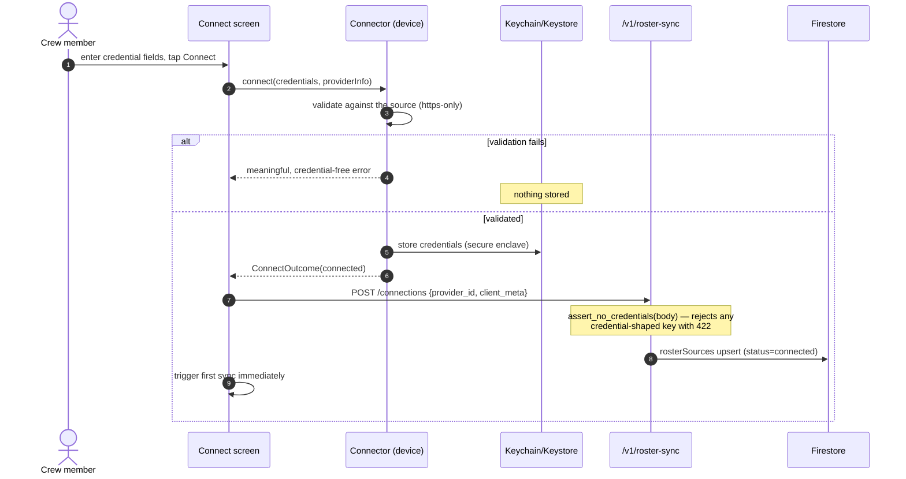
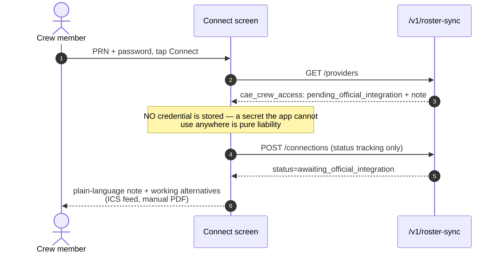

# Roster Synchronization — Design & Operations

Feature: Automatic Roster Synchronization (primary source: CAE Crew Access).
Implements the feature spec end-to-end within its own hard constraints: **no
unofficial, reverse-engineered, or ToS-violating integration — ever**, and
**credentials only in device secure storage** (iOS Keychain / Android
Keystore), never on any NAJM server or database.

Component map (spec modules → code):

| Spec module | Implementation |
|---|---|
| RosterConnector | `flutter_app/lib/core/roster_sync/roster_connector.dart` (interface + registry) with `providers/cae_crew_access_connector.dart`, `providers/ics_feed_connector.dart` |
| RosterSyncService | `flutter_app/lib/core/roster_sync/sync_service.dart` (`RosterSyncService`) |
| RosterImportService | `python_services/roster_sync/import_service.py` (line build + legality/rest/salary enrichment + supersede + write) |
| RosterParser | `python_services/roster_sync/ics_parser.py` (+ each provider's `parse_payload`) |
| RosterVersionService | `python_services/roster_sync/version_service.py` (checksum, version chain, leg-level diff) |
| SyncScheduler | `flutter_app/…/sync_service.dart` (`SyncScheduler`: periodic + connectivity-regained + app-resumed) |
| CredentialManager | `flutter_app/lib/core/roster_sync/credential_manager.dart` |
| ConnectionHealthMonitor | `flutter_app/…/sync_service.dart` (`ConnectionHealthMonitor`) |
| Engine fan-out | `python_services/roster_sync/engine_fanout.py` |

---

## 1. Sequence — Connect (client-orchestrated provider, e.g. ICS feed)



## 2. Sequence — Scheduled sync (client-orchestrated)

```mermaid
sequenceDiagram
    autonumber
    participant S as SyncScheduler (device)
    participant SVC as RosterSyncService (device)
    participant C as Connector
    participant K as Keychain/Keystore
    participant API as /v1/roster-sync
    participant V as VersionService
    participant I as ImportService
    participant E as Engine fan-out

    S->>SVC: syncAll() (periodic / connectivity regained / app resumed)
    SVC->>API: GET /status
    SVC->>C: fetchRoster(period, year)
    C->>K: read credentials
    C-->>SVC: RosterPayload (raw ICS / normalized)
    SVC->>API: POST /import
    API->>V: checksum + compare with latest version
    alt checksum unchanged
        API-->>SVC: result=duplicate (no writes)
    else changed roster
        API->>V: leg-level diff (added/removed/changed)
        API->>I: build line (summary, salary est., legality flags,<br/>rest scores — canonical rules), supersede previous ACTIVE
        I->>I: write flightLines doc (source=provider, version)
        API->>E: fan-out (salary/FTL/rest triggered; behavior +<br/>auto-bid queued; trade/layover/knowledge on_demand)
        API-->>SVC: result=imported {version, diff, engines[]}
    end
    API->>API: rosterSources: lastSync/lastSuccess/importedFlights;<br/>syncEvents analytics record
```

## 3. Sequence — CAE Crew Access today (honest pending) and after activation



After activation (`CAE_INTEGRATION_MODE=enterprise_service` — the expected
production route): syncs are **server-orchestrated** with NAJM's enterprise
service credentials from the secret manager; the device calls
`POST /connections/{id}/sync-now` and user passwords are never part of the
flow at all. `device_oauth` mode additionally requires CAE's published
client parameters (activation checklist below).

## 4. Sequence — Failure & offline

```mermaid
sequenceDiagram
    autonumber
    participant S as Scheduler
    participant SVC as SyncService
    participant API as /v1/roster-sync

    S->>SVC: syncAll()
    alt device offline
        SVC--xAPI: unreachable
        Note over SVC: cached roster untouched; AI keeps working on it
        S->>S: retry on connectivity regained
    else fetch/parse fails
        SVC->>API: POST /import (bad payload)
        API-->>SVC: 422 meaningful error
        Note over API: previous roster and version chain untouched;<br/>rosterSources.last_error set; syncEvents sync_failed
    end
```

Disconnect: `DELETE /connections/{id}` (server stops tracking; imported
rosters are kept) **and** `CredentialManager.wipeProvider` erases every
locally stored credential — both run even if one fails.

---

## 5. Security model — governed by the Zero-Knowledge Credential Model

**The governing rule is `docs/ZERO_KNOWLEDGE_CREDENTIALS.md` (MANDATORY,
permanent platform rule).** In short: credentials never reach NAJM; the device
authenticates, the device normalizes, and only a normalized roster is
uploaded. Six independent walls (secure enclave · normalized-only uploads ·
inbound guard · outbound guard · log redaction · Firestore rules), the
per-provider owner-approval gate for any server-managed model (ODR-004), and
the golden-fixture parity guard between the device and server ICS parsers are
all specified there.

### Original two-wall summary (superseded by the six walls above)

1. **Device wall** — credentials exist only inside
   `flutter_secure_storage` (Keychain / Keystore with
   EncryptedSharedPreferences). Connectors never place credentials in logs,
   exceptions, or network payloads; ICS error notes are written to never
   echo the URL (feed URLs can embed personal tokens) — unit-tested.
2. **Server wall** — every `/v1/roster-sync` payload passes
   `assert_no_credentials` **before model parsing**: any credential-shaped
   key (password/token/secret/…) is rejected with 422, so even a buggy or
   malicious client cannot persist a secret server-side. Firestore rules add
   a third layer: `rosterSources`/`rosterVersions` are owner-read,
   service-write-only; `syncEvents` is service-only.

## 6. Priority & versioning

Provider priority per spec: **CAE Sync → ICS feed → Manual upload** (the
status endpoint computes `preferred_source`). Imports write the same
`flightLines` shape the whole platform consumes — filter engine, ranking,
legality, AI — with `source` + `syncVersion` provenance; superseded docs are
kept `isActive:false` (version history), and `rosterVersions` records
checksum + added/removed/changed per version.

## 7. Analytics (spec list → `syncEvents` fields)

`connect_ok` / `connect_blocked` / `sync_ok` / `sync_failed` / `duplicate`
events carry: provider, user, duration_ms (sync duration), imported_flights,
version, detail. Connection success rate, failure rate, duplicate detection
and roster-version changes are direct aggregations over this collection
(service-side; clients cannot read or write it).

## 8. Activation checklist — CAE official integration

1. Obtain the official/enterprise API access from CAE (agreement + docs).
2. Set `CAE_INTEGRATION_BASE_URL` and `CAE_INTEGRATION_MODE`
   (`enterprise_service` recommended) on the Python service.
3. `enterprise_service`: implement `CaeCrewAccessProvider.server_fetch`
   against the documented endpoints (service credentials via the secret
   manager — never user passwords); the sync-now path, import pipeline,
   versioning, fan-out, status UI and analytics are already live and tested
   through the ICS provider.
4. `device_oauth` (only if CAE publishes a device flow): wire the published
   OAuth parameters into `CaeCrewAccessConnector` and hand the normalized
   roster to the existing `POST /import` (payload_kind `normalized`).
5. Flip nothing else — availability, catalog, Settings UI and connection
   states update automatically from the configuration.

## 9. Background execution note

The shipped `SyncScheduler` covers the spec triggers without native plugins:
periodic while running, connectivity-regained, app-resumed. True OS
background fetch (Android WorkManager / iOS BGTaskScheduler) is a drop-in
upgrade behind `SyncScheduler.triggerNow` when the team is ready to take the
`workmanager` dependency + platform configuration.
